```mermaid
graph TD
    %% Definición de componentes principales (nodos) y agrupaciones en Azure
    subgraph Frontend [Capa de Presentación: React.js]
        U((Usuario))
        ReactApp[Aplicación Web React]
    end

    subgraph Azure_Cloud [Entorno Microsoft Azure]
        direction TB

        SWA[Azure Static Web Apps]
        Backend_Service[Azure App Service: Node.js Web API]
        SQL_DB[(SQL Azure Database)]

        SWA --- Backend_Service
        Backend_Service --- SQL_DB
    end

    %% Definición de las interacciones (edges)
    U -- "Interactúa con" --> ReactApp
    ReactApp -- "Acceso Público (HTTPS)" --> SWA
    SWA -- "Llama a la API (Interna)" --> Backend_Service
    Backend_Service -- "Conexión DB" --> SQL_DB
    SQL_DB -- "Datos" --> Backend_Service
    Backend_Service -- "Respuesta JSON" --> SWA
    SWA -- "Renderiza UI" --> ReactApp

    %% Estilo (opcional)
    style Frontend fill:#e1f5fe,stroke:#333,stroke-width:2px;
    style Azure_Cloud fill:#bbdefb,stroke:#0078D4,stroke-width:3px,color:#0078D4;
    style SWA fill:#ffffff,stroke:#333,stroke-width:1px;
    style Backend_Service fill:#ffffff,stroke:#333,stroke-width:1px;
    style SQL_DB fill:#ffffff,stroke:#333,stroke-width:1px;
```

<div style="text-transform:uppercase;text-align:center; font-weight: bold; background-color: #164e62; color: white; padding: 15px; border-radius: 5px; box-shadow: 10px 10px 20px #999; top:5px">
   Sistema de Inventario Vehicular
</div>


  <div style="text-align:center; color: white">
    <h4 style="font-weight: bold; background-color: #164e62; color: white;"><b>Tabla de Contenidos</b></h4>
  </div>
  <div style=" background-color: #A7CFDB; border-radius: 5px; color: white;font-weight: bold;text-align:center">

[Inicio Sesión](#inicio-sesión)
[Descripción](#descripción)
[Tecnologías Utilizadas](#tecnologías-utilizadas)
[Instalación](#instalación)
[Estructura del Proyecto](#estructura-del-proyecto)
    </div>


<div style="box-shadow: 0 4px 8px 0 rgba(0,0,0,0.2);
  transition: 0.3s;">
  <div style="text-align:center;font-weight: bold; background-color: #A7CFDB;">
    <h4 ><b style="color: white">
    
## Inicio Sesión
</b></h4>
  </div>
  

</div>


<div style="box-shadow: 0 4px 8px 0 rgba(0,0,0,0.2);
  transition: 0.3s;">
  <div style="padding: 2px 5px;text-align:center;">
    <h4 style="font-weight: bold; background-color: #A7CFDB; color: #FFFFFF"><b style="color: white">

## Descripción 
</b></h4>
    <p>Este proyecto full stack es una aplicación para la gestión de inventario de vehículos que permite a los usuarios crear, leer, actualizar y eliminar registros en una base de datos SQL Sever, con autenticación de token JWT.

La motivación principal fue crear una solución eficaz para el manejo sensible de los movimientos vehiculares en el inventario asi como sus actualizaciones. El proyecto utiliza las mejores prácticas dentro de las tecnologias 
de React para la parte de front y NodeJS para el backend respectivamente.
    </p>
  </div>
</div>


<div style="box-shadow: 0 4px 8px 0 rgba(0,0,0,0.2); color: white;
  transition: 0.3s;">
  <div style=";text-align:center;">
    <h4 style="font-weight: bold; background-color: #A7CFDB; color: white;"><b style="color: white">

## Tecnologías Utilizadas
   </b></h4>
    <div style=" background-color: #A7CFDB; border-radius: 5px; color: white;font-weight: bold;">

### Frontend
*   [React](react.dev) 
*   [Tailwind CSS](tailwindcss.com)
*   [FontAwesome](tailwindcss.com)
*   [Vite](tailwindcss.com)
*   [Tanstack](tailwindcss.com) 
*   [React Router](tailwindcss.com) 
    </div>

     <div style=" background-color: #A7CFDB; border-radius: 5px; color: white;font-weight: bold;">

### Backend
*   [Documentación Swagger](https://backpowerfleet-e6e4eub9akf9ecbd.mexicocentral-01.azurewebsites.net/api-docs)
*   [Node.js](nodejs.org)
*   [Express](expressjs.com)
*   [JWT](tailwindcss.com)
*   [BCrypt](tailwindcss.com)
    </div>

     <div style=" background-color: #A7CFDB; border-radius: 5px; color: white;font-weight: bold;">

### Base de Datos
*   SQL Server - Azure
#### Diagrama Entidad-Relación (ERD)


   </div>

   <div style=" background-color: #A7CFDB; border-radius: 5px; color: white;font-weight: bold;">

### Infraestructura
*   [Repositorio GitHub](https://github.com/LMPR140625/TestPowerFl)
*   [Azure Static Web App](https://green-pebble-0de6a5b0f.3.azurestaticapps.net))
*   [Azure App Service](backpowerfleet-e6e4eub9akf9ecbd.mexicocentral-01.azurewebsites.net)
    </div>
  </div>
</div>


<div style="box-shadow: 0 4px 8px 0 rgba(0,0,0,0.2);
  transition: 0.3s;">
  <div style="padding: 2px 5px;text-align:center;">
    <h4 style="font-weight: bold; background-color: #A7CFDB; color: white;"><b style="color: white">

## Instalación
   </b></h4>
    <p>Sigue estos pasos para configurar el proyecto localmente. Asegúrate de tener instalado [Node.js](nodejs.org) (versión 22) y [Git](git-scm.com).
    </p>
  </div>
  <div>
  
```bash
# 1. Clona el repositorio
git clone https://github.com/LMPR140625/TestPowerFl.git

# 2. Navega al directorio del proyecto
cd TESTPOWERFL

# 3. Instala las dependencias del frontend
cd ../Front/Inventory_Vehicles
npm install

# 4. Instala las dependencias del backend
cd ../Back
npm install

# 4. Ejecuta el script dentro de tu BD
init.db
```
</div>
</div>


<div style="box-shadow: 0 4px 8px 0 rgba(0,0,0,0.2);
  transition: 0.3s;">
  <div style="padding: 2px 5px;text-align:center;">
    <h4 style="font-weight: bold; background-color: #A7CFDB; color: white;"><b style="color: white">

### Estructura del Proyecto
   </b></h4>
    <p>A continuación se presenta la estructura general del proyecto, arquitectura y objetos por cada proyecto
    </p>
  </div>

  <div style="text-align:center">



  </div>


*   <span style="color: blue;">📂 **/TESTPOWERFL/**</span>: Raiz de Proyecto
**   <span style="color: gray;">     📁 **/Front/Inventory_Vehicles**</span>: Proyecto de Front end en React
***  <span style="color: green;">        ✅ **/docs/**</span>: Archivos de proyecto
**   <span style="color: gray;">📁 **/Back/**</span>: Proyecti de Back en Node JS
***   <span style="color: green;">        ✅ **/docs/**</span>: Archivos de proyecto
**   <span style="color: gray;">     📁 **/.github/**</span>: Workflows de Front y Back
***   <span style="color: green;">        ✅ **/docs/**</span>: Workflows.
**   <span style="color: gray;">     📁 **/assets/**</span>: Recursos proyecto


<div>

```
.
|-- .github
|                   `-- workflows
|       |           `-- azure-static-web-apps-green-pebble-0de6a5b0f.yml
|                   `-- main_backpowerfleet.yml
|-- Back
|   |-- .env
|   |-- .gitignore
|   |-- app.js
|   |-- config
|   |   |           `-- config.js
|   |               `-- database.js
|   |-- controllers
|   |   |           `-- token.controller.js
|   |               `-- vehicles.controller.js
|   |-- middlewares
|   |   |           `-- auth.js
|   |   |           `-- customResponse.js
|   |               `-- errorHandler.js
|   |-- models
|   |               `-- vehicleModel.js
|   |-- package-lock.json
|   |-- package.json
|   |-- routes
|   |   |           `-- login.routes.js
|   |               `-- vehicles.routes.js
|   |-- server.js
|   |-- services
|   |   |           `-- loginService.js
|   |               `-- vehicleService.js
|   `-- utils
|       |           `-- AppError.js
|                   `-- catchAsync.js
|-- Front
|   `-- Inventory_Vehicles
|       |           `-- .env
|       |           `-- .env.production
|       |           `-- .gitignore
|       |           `-- README.md
|       |           `-- eslint.config.js
|       |           `-- index.html
|       |           `-- package-lock.json
|       |           `-- package.json
|       |           `-- public
|       |           `-- vite.svg
|       |-- src
|       |   |       `-- App.css
|       |   |       `-- App.jsx
|       |   |       `-- api
|       |   |   |   `-- apiClient.js
|       |   |       `-- auth.js
|       |   |-- assets
|       |   |       `-- react.svg
|       |   |-- components
|       |   |   |   `-- AlertComponent.jsx
|       |   |   |   `-- ButtonSearch.jsx
|       |   |   |   `-- CardComponent.jsx
|       |   |   |   `-- ConfirmacionComponent.jsx
|       |   |   |   `-- InputComponent.jsx
|       |   |   |   `-- InputSearch.jsx
|       |   |   |   `-- SearchComponent.jsx
|       |   |   |   `-- SelectorStatus.jsx
|       |   |   |   `-- SelectorYears.jsx
|       |   |       `-- TableSelectionComponent.jsx
|       |   |-- hooks
|       |   |       `-- useLogin.js
|       |   |-- index.css
|       |   |-- layout
|       |   |   |   `-- Footer.jsx
|       |   |   |   `-- Header.jsx
|       |   |   |   `-- Hero.jsx
|       |   |   |   `-- MainLayout.jsx
|       |   |   |   `-- Subtitle.jsx
|       |   |       `-- Title.jsx
|       |   |-- main.jsx
|       |   `-- pages
|       |       |   `-- DetailVehicle.jsx
|       |       |   `-- FormNewVehicle.jsx
|       |       |   `-- HomePage.jsx
|       |       |   `-- Login.jsx
|       |           `-- TableVehicles.jsx
|       `-- vite.config.js
|-- README.md
`-- assets
    `-- sistemaVehicular.png
```
</div>
</div>